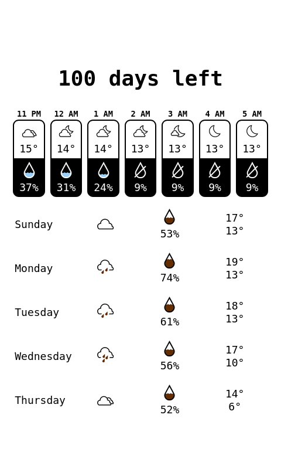

# Raspberry Pi Home Display



This project displays a dashboard with weather and other information on a Waveshare e-Paper display connected to a Raspberry Pi.

## Installation

These instructions assume you are setting up on a Raspberry Pi.

After cloning this repository, run the setup script to install all dependencies:

```bash
./setup.sh
```

This script will:
- Install required system packages using `apt-get`.
- Clone the [Waveshare e-Paper library](https://github.com/waveshareteam/e-Paper) into the parent directory.
- Install Python dependencies for the e-Paper library using `pip`.
- Install Node.js dependencies using `npm`.

You may need to make the script executable first:
```bash
chmod +x setup.sh
```

### Enable SPI

- Run `sudo raspi-config`
- Select Interfacing Options
- Arrow down to SPI
- Select yes when it asks you to enable SPI

## Usage

### Manual Update

You can run the `update` script to refresh the screen at any time:
```bash
./update
```

### Automatic Updates with Cron

To have the screen update automatically, you can add the provided `crontab` file to your system's cron jobs. This will run the update script every minute.
```bash
crontab crontab
```

### Syncing from a Development Machine

A `sync` script is included to easily push changes from your development machine to the Raspberry Pi using `rsync`. You will need to edit the script to set the correct user and hostname for your Raspberry Pi.
```bash
./sync
```
